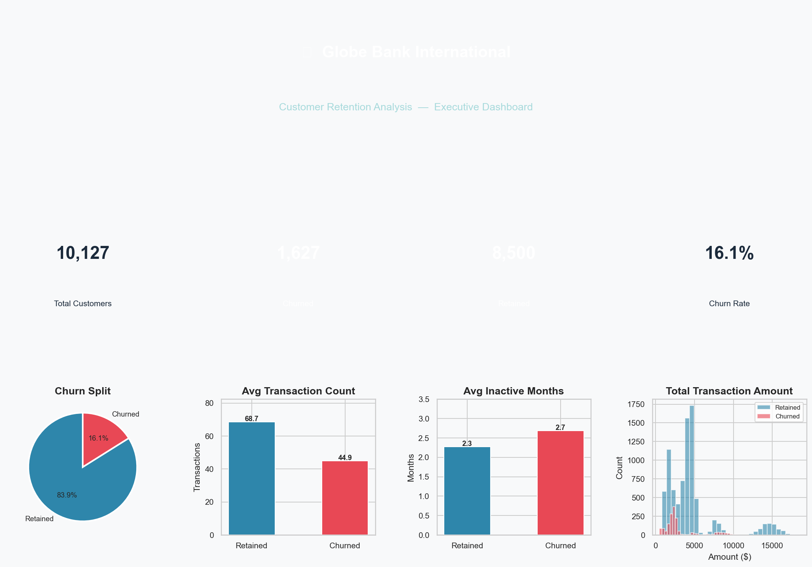

# 🏦 Globe Bank International — Customer Retention Analysis

> An end-to-end customer churn analysis project built in Python, covering data exploration, cleaning, statistical analysis, and data storytelling.

---



---

## 📌 Project Overview

Globe Bank International is losing customers. This project analyses **10,127 credit card customers** to uncover the key drivers of churn, identify at-risk customer segments, and deliver actionable retention recommendations for the business.

This is a **portfolio project** demonstrating a full data analysis workflow — from raw data through to polished visualisations and business insights.

---

## 🔍 Key Findings

- 📉 **16.1% churn rate** — 1 in 6 customers left the bank
- 💳 **Transaction count and amount** are the strongest predictors of churn — less active customers leave at a much higher rate
- 😴 **Inactive customers** (2+ months) are significantly more likely to churn
- 📞 **High contact frequency** signals dissatisfaction, not engagement
- 🔗 **Customers with fewer bank products** have lower retention rates

---

## 🗂️ Project Structure

```
globe-bank-retention-analysis/
│
├── data/
│   ├── raw/                         ← Original dataset (never modified)
│   └── processed/                   ← Cleaned, analysis-ready data
│
├── notebooks/
│   ├── 01_setup_exploration.ipynb   ← Stage 1: EDA & data inspection
│   ├── 02_cleaning_transformation.ipynb  ← Stage 2: Cleaning & feature engineering
│   ├── 03_analysis_insights.ipynb   ← Stage 3: Statistical analysis & churn drivers
│   └── 04_visualisation_storytelling.ipynb ← Stage 4: Dashboards & recommendations
│
├── outputs/
│   ├── figures/                     ← Saved .png charts
│   └── reports/                     ← Saved .html interactive charts
│
├── .gitignore
├── README.md
└── requirements.txt
```

---

## 📊 Project Stages

| Stage | Notebook | Description |
|---|---|---|
| 1 | `01_setup_exploration.ipynb` | Load data, data dictionary, quality checks, initial distributions |
| 2 | `02_cleaning_transformation.ipynb` | Encode variables, feature engineering, save processed data |
| 3 | `03_analysis_insights.ipynb` | Correlation analysis, demographic breakdowns, t-tests, Random Forest importance |
| 4 | `04_visualisation_storytelling.ipynb` | Executive dashboard, churn driver charts, recommendations |

---

## 🛠️ Tools & Libraries

| Category | Tools |
|---|---|
| Language | Python 3.13 |
| Data manipulation | pandas, numpy |
| Visualisation | matplotlib, seaborn, plotly |
| Statistical analysis | scipy |
| Machine learning | scikit-learn (Random Forest) |
| Environment | Jupyter Notebook, VS Code |

---

## 📁 Dataset

- **Source:** [Analyttica Treasure Hunt](https://leaps.analyttica.com/home) via Kaggle
- **File:** `BankChurners.csv`
- **Rows:** 10,127 customers
- **Columns:** 21 features (after dropping Naive Bayes and ID columns)
- **Target variable:** `Attrition_Flag` — 1 = Churned, 0 = Retained

> ⚠️ The raw dataset is not included in this repository. Download it from the link above and place it at `data/raw/BankChurners.csv` before running the notebooks.

---

## 🚀 Getting Started

### 1. Clone the repository
```bash
git clone https://github.com/moshraf/globe-bank-retention-analysis.git
cd globe-bank-retention-analysis
```

### 2. Create and activate a virtual environment
```bash
python -m venv .venv
.venv\Scripts\activate        # Windows
source .venv/bin/activate     # Mac / Linux
```

### 3. Install dependencies
```bash
pip install -r requirements.txt
```

### 4. Download the dataset
Download `BankChurners.csv` from [Analyttica](https://leaps.analyttica.com/home) and place it in `data/raw/`.

### 5. Run the notebooks in order
Open each notebook in VS Code or Jupyter and run all cells top to bottom:
1. `01_setup_exploration.ipynb`
2. `02_cleaning_transformation.ipynb`
3. `03_analysis_insights.ipynb`
4. `04_visualisation_storytelling.ipynb`

---

## 💡 Business Recommendations

| Priority | Finding | Recommended Action |
|---|---|---|
| 🔴 High | Low transaction activity signals churn | Trigger re-engagement campaigns when transaction count drops |
| 🔴 High | Inactive customers churn at higher rates | Implement 60-day inactivity alerts with personal outreach |
| 🟠 Medium | Fewer products = lower retention | Cross-sell complementary products to single-product customers |
| 🟠 Medium | High contact count signals dissatisfaction | Flag 3+ contact customers for proactive satisfaction review |
| 🟡 Low | Lower income segments churn more | Review product-market fit and offer tailored entry-level cards |

---

## 👤 Author

**Moshraf Hossain**
- 💼 [LinkedIn](https://www.linkedin.com/in/moshrafhossain/)
- 🌐 [Portfolio Website](https://moshraf.github.io/)
- 🐙 [GitHub](https://github.com/moshraf)

---

*This project was built as part of a data analytics portfolio. All data is publicly available and used for educational purposes only.*
